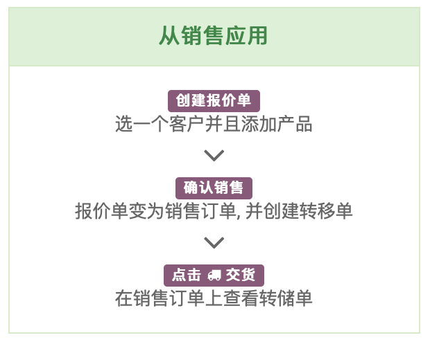
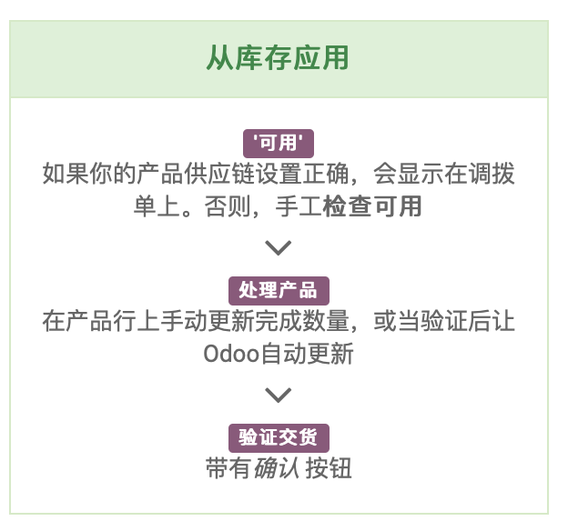
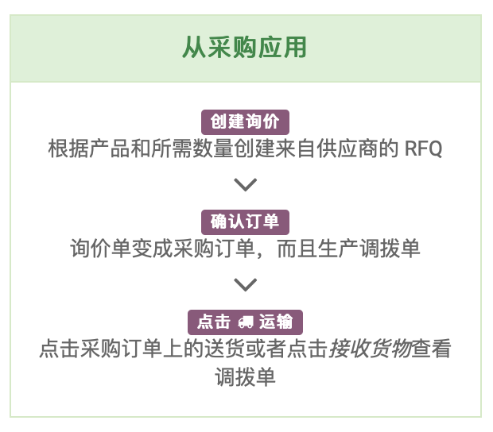
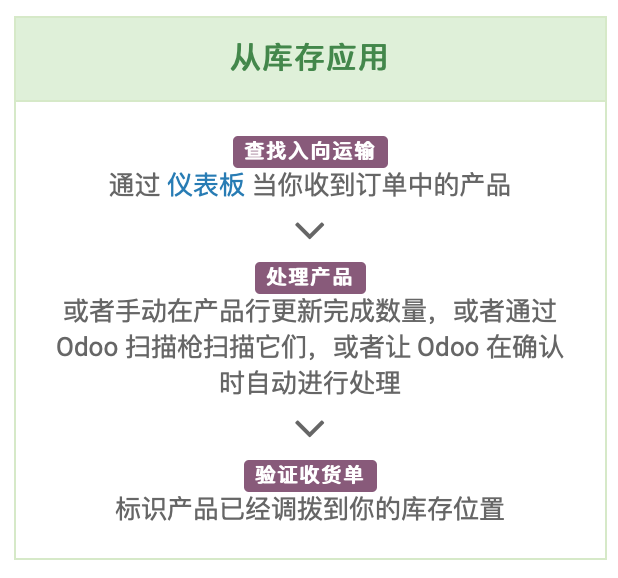

# 库存管理

## 你的产品
* 产品类型
    * 库存产品：受制于全面的库存管理，例如最小库存规则、自动补货等等
    * 可消耗产品：被设定为数量总是能够满足需求，也就是不跟踪可用数量
    * 服务类产品：由公司或者个人提供的非实物产品。
* 供应链
    * 制造：产品内部制造或者服务通过内部资源提供
    * 购买：产品是通过采购订单从供应商处购买
    * 按库存补货：以库存中的货物提供给你的客户。如果仓库中的数量太少不能够满足订单，系统会根据最小库存规则自动生成采购订单来获取所需产品。
    * 按订单补货：产品只在每份销售订单确定后根据需求补货，你会就以下单的数量来进行精确补货，这不会再中期更改库存。
* 手上/可用数量
    * 手上产品：目前仓库中的数量。包含已经被相关生产订单或销售订单占用数量。
    * 可用产品：是能够满足新的订单对生产或者分销目的的产品。此数量不包含已经被其他订单占用的数量或者采购自供应商的在途物资。
* 测量单位
    * 默认情况下，单位的通用单位是“件”，它是一般性而且所有的产品都可以用它来表示。
    * 使用更加精确的计量单位，如磅或千克。
    * 请注意每个单位的种类之间是否可以自由的进行换算。

## 初始库存

所有的产品创建后检查所有的单位与单价无错误的情况下，既可以进行所有产品的盘点。

## 销售流程

经典的销售流程如下：
库存管理管理和销售高度的集成化，从原始的报价单到发货和库存准备系统均进行自动化的进行准备状态，你需要做的仅仅是确认需求和准备。

## 采购流程
就像销售流程一样，仓库管理系统和采购也是整体集成，根据重订货规则采购人员完全不需要了解工厂目前的库存。

## 重订货规则

良好的库存管理皆在优化库存水平：不要太低（或者你可能会发现自己缺货），而不是太高（你的产品占用空间并且可能会失去价值）

在系统中，订货规则被用来补货。系统将自动建议补货单以购买新产品如果你先缺货的情况下：
可以在订购：可库存产品简要输入最小和最大数量。

## 解决补货异常

如果你配置了自动补货，系统可以自动产生补货单，通常你不需要担心。但是有的时候因为系统阻塞没有生成相关的订单，这通常是因为配置出现了问题。

所有最好试着检查并解决这些补货异常。
* 生产没有定义产品物料表：你需要创建一个物料表或者制定该产品的可以是采购的。
* 采购信息中缺少供应商信息：你可以再产品表单的补货页面定义供应商
* 供货商没有定义供应商的地址：你可以给默认的供应商定一个产品相关的地址。
* 库存中没有足够的数量：你可以通过创建订货规则来自动创建订单或者手动采购。

## 产品追述性

用产品批次和序列号可以让系统运行高级追踪 通常是根据贴在产品上的条码进行。

批次可以在 进货、内部转移和根据操作类型的设置中发送传送出交货中被编码。可以在每个产品上配置追踪：完全没有任何最终、按批次追踪或按唯一的序列号。

在序列号的案件中，每一个序列号只对应一个文档。在批次的案例中，当你移动产品时，你需要给每个批次提供数量。

如何使用批次追踪

* 激活 跟踪批次或序列号 在你的库存设置中
* 在产品表单设置追踪字段可以用来追踪批次或者序列号码
* 当你再操作一个入项运输、内部调拨或者交货，通过点击菜单图标，指派一个批次号或者不同的批次号或者序列号至产品。

要查看大量的轨迹，请在 盘点控制和序号/批次。在列表中选择一个批次，然后点击 可追述性。你也可以用某些批次来过滤产品的定量评估。

## 路线管理

处理 高级推/拉式配置，例如：
* 管理产品的制造链条
* 为每个产品管理默认位置
* 在你的仓库根据业务需求定义线路，例如质量控制、售后服务或者供应商退货
* 租用管理协助是从租借产品自动生成退回移动

# CRM客户管理

CRM不仅仅是一个工具，它再你的 销售也集中产生重要的影响。

设置销售管道只是第一步。要实现显著地提升，我们将帮助你尽量利用CRM来改造你的销售人员的工作。

整个流程管理下来可能需要话费几个小时，但是非常值得这样去做。

## 你的预期

你的销售目标是什么？你目前面临的挑战是什么？搞清楚想要什么是成功的第一步

* 销售目标：
    * 团队活动的更好可见度
    * 有明确的预期销售
    * 成长线索获取
    * 提高每个销售人员的平均收入
    * 超售更多给现有客户
    * 较好架构销售流程

## 你的关键绩效指标

你需要跟踪的销售活动关键 KPI是什么？

你的主要KPI：
* 销售预测（月+1）
* 赢得/失去比率
* 销售人员收入
* 完成交易的时间
* 验证线索的时间
* 线索源头

## 管道

系统化组织造成了优秀的销售员与伟大销售员之间的差异！设置一个符合你销售周期的管道。

让你的销售组织进行系统化 流程化能够让你持续改进销售业绩。

* 销售阶段：
    * 方案销售
    * B2C
    * B2B

* 方案销售
    * 领域：分配给正确销售人员的新潜在客户
    * 验证：预期收入、预计截止日期、下一步销售操作
    * 合格咱树上：您正在与决策者进行讨论、并且他对自己的需求表示同意
    * 建议：发送给客户的报价单
    * 赢得：客户签署的报价单

* B2C
    * 初步联系：致电询问客户需求
    * 产品演示：使用演示PPT的会议，预计收入和截止日期
    * 建议：报价单已经送出。
    * 赢得：客户签署的报价单
* B2B
    * 新建：预期收入、预计截止日期、下一步销售操作。
    * 验证：如果出现 "销售天数 * ¥500“ < "预期收入" * 的情况，请关闭商机。
    * 需求评审：与客户进行 GAP 分析
    * 售出的 POC：与顾问一起分析客户需求
    * 演示：针对客户进行POC演示
    * 建议：发送最终的提案。
    * 赢得

> * 优秀的管道应该包含有 5 至 7 个阶段
> * 第一阶段通常是“新的”，最后一个是“赢”
> * 不要用阶段来符合商机的资格，要用标签
> * 每个阶段都应该是买方决策向前迈出的一步，而不是要执行的一个任务。

伟大的管道阶段与买方流程一致，不是你的销售过程：
|||
|-|-|
|例如：验证阶段| 例如：洽谈阶段|
| <b>客户</b>知道自己的痛点并且再下次购买流程中提供建议| <b>潜在客户</b>开始讨论你的服务|
| <b>你</b>理解客户的需求并抓住痛点，并且你对他的预算如何支配有相当不错的理解|<b>你</b>称之为前景作为你的销售跟进。

推荐：
* 配置你的销售管道的阶段
* 创建三个优先商机作为一个练习。
